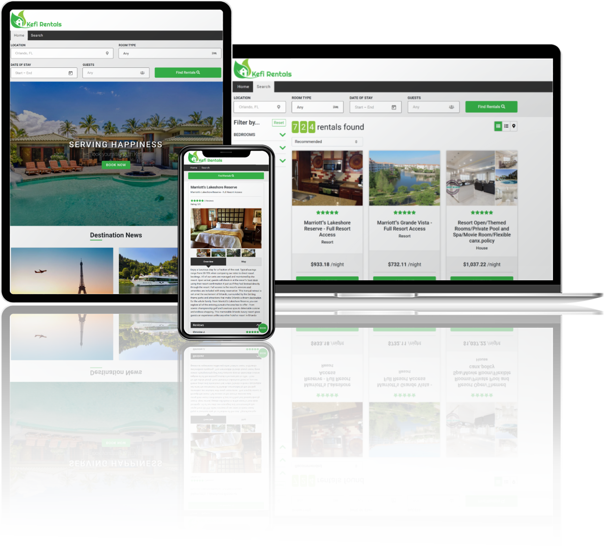

<span style="float:right;font-size:16px;color:grey;">
    <a href="#about" style="color:white;">About</a> |
    <a href="#api-documentation" style="color:white;">Docs</a> |
    <a href="#specifications" style="color:white;">Specs</a> |
    <a href="#technologies" style="color:white;">Tech</a>
    </span>
<h1>Kefi Rentals</h1>

## Preview


## About
<b><i>Kefi Rentals</i></b> is a web application developed for viewing and booking vacation homes anywhere throughout the world. It is currently grabbing information from Vrbo and other traveling resources such as TravelPulse.

URL: https://staykefi.com/

<hr/>

## API Documentation
Use the API base URL: https://kefi-api.herokuapp.com/

### Retrieve Travel News
Returns json data for today's articles about travel destinations.

<ul>
  <li>
    <b>URL:</b>
    <br/>
    /api/travel-news
  </li>
  <li>
    <b>Method:</b>
    <br/>
    GET
  </li>
  <li>
    <b>Response:</b>
    
```json
[
      {
        "location": {
            "url": "https://example.com/",
            "title": "Example"
        },
        "thumbnail": {
            "alt": "This is an example image",
            "src": "https://example.com/example.png"
        },
        "category": {
            "url": "https://example.com/",
            "title": "Example"
        },
        "headline": "Example Headline",
        "url": "https://example.com/article/"
      }         
    ]
```
  </li>
</ul>

### Retrieve City Locations
Returns json data for locations searched by users.

<ul>
  <li>
    <b>URL:</b>
    <br/>
    /api/locations?locations=<span style="color:orange;">{{CityName}}</span>
  </li>
  <li>
    <b>Method:</b>
    <br/>
    GET
  </li>
  <li>
    <b>Response:</b>
    
```json
{
    "items": [
        {
            "city": {
                "code": "orlando",
                "id": 60272,
                "name": "Orlando"
            },
                "name": "Orlando, Florida, US",
                "country": {
                "code": "us",
                "name": "United States"
            },
            "region": null,
            "state": {
                "code": "florida",
                "name": "Florida"
            },
            "type": "city"
        }       
    ]
}
```
  </li>
</ul>

### Retrieve Properties
Returns json data for active properties based on search queries.

<ul>
  <li>
    <b>URL:</b>
    <br/>
    /api/properties?cityId=<span style="color:orange;">{{CityId}}</span>
  </li>
  <li>
    <b>Method:</b>
    <br/>
    GET
  </li>
  <li>
    <b>Response:</b>
    
```json
{
    "properties": [
        {
            "airbnb_property_id": 10,
            "rating": 10,
            "bathrooms": 2,
            "title": "Example Property",
            "bedrooms": 2,
            "accommodates": 8,
            "id": 10,
            "img_cover": "https://example.com/example.jpg",
            "reviews": 2,
            "homeaway_property_id": "34",
            "longitude": -75,
            "latitude": 22.5,
            "adr": 933,
            "property_type": "Resort",
            "room_type": "Entire home/apt",
            "platforms": {
                "airbnb_property_id": null,
                "homeaway_property_id": "34"
            }
        }      
    ]
}
```
  </li>
</ul>

### Retrieve Vrbo Property Details
Returns json data for all information on a property gathered from Vrbo.

<ul>
  <li>
    <b>URL:</b>
    <br/>
    /api/vrbo/<span style="color:orange;">{{PropertyId}}</span>
  </li>
  <li>
    <b>Method:</b>
    <br/>
    GET
  </li>
  <li>
    <b>Response:</b>
    
```json
{
    "listingReducer": {
        ...Response is too long for readme
    },
    "reviewsReducer" : {
        ...Response is too long for readme
    }
}
```
  </li>
</ul>

<hr/>

## Specifications
<ul>
    <li>Angular 12</li>
    <li>Node v14.17.0</li>
    <li>TypeScript v4.2.4</li>
</ul>

## Technologies

&nbsp;&nbsp; &nbsp; &nbsp; &nbsp;&nbsp; &nbsp;&nbsp; &nbsp;